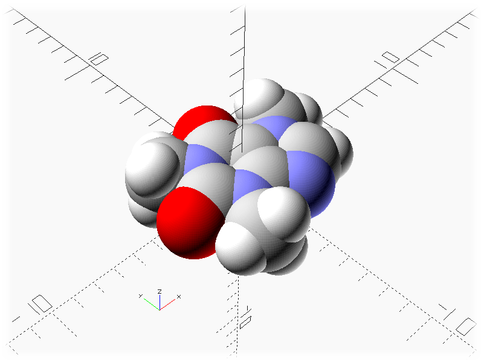

-----------------------------------------------
# Rendering Molocules Using OpenSCAD
#### Posted by glydeck 9/9/2024
-----------------------------------------------
### Screen Shot
##### Caffeine


### Introduction
This is a simple simple experiment to see how easy it is to render external data from a file in OpenSCAD.  In this case I was rendering molocule data as van der walls spheres.  Turns out it's very easy. The external 3D data files are a standard array. Each line of data in the array contains the following:

**Atom Radius,Red,Green,Blue,X posistion, Y posistion, Z posistion**
Here is a sample line of data from the array:

`[1.52,0.94,0,0,1,2,0],`
This line in the array would create a red oxygen atom with a radius of 1.52 anstroms located 2.23 angstroms from the orgin.

Color and size of the atoms is based on **van der Walls** spheres. More information can be found on **Wikipedia**:
[**van der Waals surface**](https://en.wikipedia.org/wiki/Van_der_Waals_surface)
| Element | Color | Radius |
| ----------- | ----------- |----------|
| Carbon     |  Light Grey |   1.7   |
| Oxygen     |  Red        |   1,52  |
| Hydrogen   |  White      |   1.2   |
| Nitrogen   |  Light Blue |   1.55  |
| Sulfur     |  Yellow     |   1.8   |
| Phosphorus |  Orange     |   1.8   |
| Chlorine   |  Green      |   1.75  |
| Bromine    |  Brown      |   1.85  |
| Sodium     |  Blue       |   2.4   |
| Iron       |  Orange     |   2.05  |
| Magnesium  |  Dark Green |   2.2   |
| Calcium    |  Dark Grey  |   2.4   |
| Unknown    |  Deep Pink  |   2.5   |


Some of the data I used came from an earlier experiment I did using **Blender**. This original experiment is obsolete since it was done using Python 2.7 and Blender has moved on to Python 3.

- [Blender.org](https://www.blender.org/)
- [Glydeck Blog](http://glydeck.blogspot.com/2013/09/v-behaviorurldefaultvmlo.html)
- [Glydeck Git Hub](https://github.com/glydeck/MoloculeParser)
### Requirements
The only requirement is a current version of OpenSCAD. It is free software and available for Linux/UNIX, MS Windows and Mac OS X.
[**OpenSCAD**](https://openscad.org/)
### Contents 
```
      README.md           --This File
      MoloculeData        --Folder with sample 3D molocule data
      Atoms.scad          --Shows the size and color of the atoms
      molocule.scad       --Renders the molocules from the 3D data files
      screenShot.png      --Screen shot showing an example
```
### Generating New 3D Data
My original data came from the **Protein Database**.
[**NIH Protein Database**](https://www.ncbi.nlm.nih.gov/protein/)
Since then I have found an easier way to access 3D data or even create 3D molecular data by using **Molview**
[**Molview.org**](https://molview.org/)
The protiein database and Pub Chem Compounds can be accesed through the Molview web app.  After you find the molocule you are looking for you can export the data as a MOL file.  The MOL file is text based and the 3D data will still need to be seperated from the rest of the file.
 
